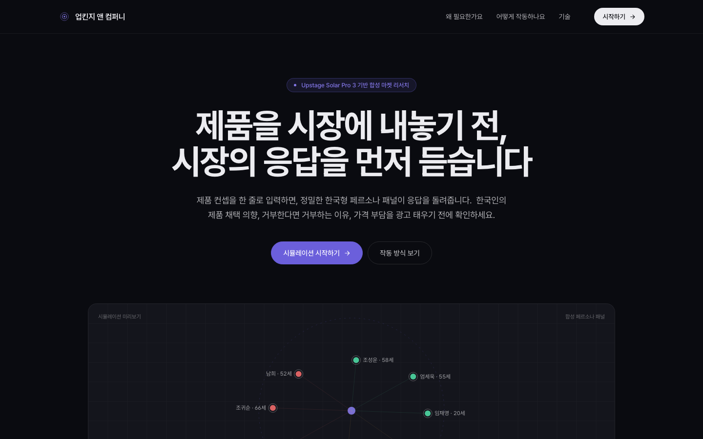
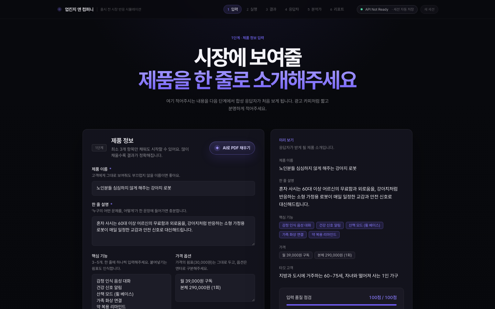
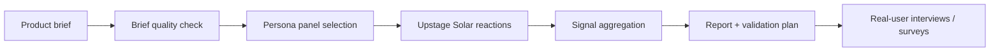

<div align="center">

# Upkinsey

**Self-hostable synthetic market research for product teams**<br>
Turn a product brief into persona reactions, market signals, objections, validation plans, and founder-ready reports.

[](LICENSE)




</div>

---

## Why Upkinsey?

Launching a product is expensive. Running lightweight market research before launch should not be.

Upkinsey lets you paste a product concept, run it against a Korean synthetic persona panel, and get structured outputs that help answer:

- Who is likely to care?
- What objections appear repeatedly?
- Which segment should we test first?
- Is pricing the blocker, or is the value proposition unclear?
- What should we ask real users next?

> **Important:** Upkinsey is a pre-research tool. Synthetic persona signals are directional hypotheses, not statistical proof or a replacement for real customer research.

## What you get

- **Synthetic persona panel** powered by Upstage Solar and Korean persona data
- **Product brief preflight** to catch missing target, pricing, alternatives, and hypothesis details
- **Adoption / need-fit / price-risk signals** with confidence guardrails
- **Objection mining** and segment recommendations
- **Message angle tests** for landing-page and survey copy
- **Pricing sensitivity lab** for willingness-to-pay probes
- **Validation plan** with screener questions, interview guide, and survey draft
- **Founder memo** and portable Markdown report export
- **Saved run versions** with comparison against previous simulations
- **Self-hosting safety controls** for paid API protection

## Preview



## How it works



## Quick start

### 1. Clone and install

```bash
git clone https://github.com/Jaeyeong-CHOI/upkinsey.git
cd upkinsey

python3 -m venv .venv
source .venv/bin/activate
pip install -e '.[persona]'
```

### 2. Configure environment

```bash
cp .env.example .env
```

Edit `.env`:

```env
UPSTAGE_API_KEY=your_upstage_api_key
UPKINSEY_REQUIRE_BASIC_AUTH=1
UPKINSEY_BASIC_AUTH_USER=operator
UPKINSEY_BASIC_AUTH_PASSWORD=change-this-password
```

### 3. Run tests

```bash
PYTHONPATH=src python3 -m unittest discover -s tests -p 'test*.py' -v
```

### 4. Start the app

```bash
python scripts/run_upkinsey_server.py --port 5173
```

Open:

```text
http://localhost:5173
```

## Self-hosting

Upkinsey serves the static prototype and API from one Python server. For public or semi-public deployment, keep the paid Upstage API behind server-side auth and rate limits.

Recommended production defaults:

```env
UPKINSEY_REQUIRE_BASIC_AUTH=1
UPKINSEY_ALLOW_DESTRUCTIVE_API=0
UPKINSEY_MAX_PARALLEL_REQUESTS=2
UPKINSEY_MAX_ACTIVE_JOBS=2
UPKINSEY_RATE_LIMIT_PER_MINUTE=30
UPKINSEY_MAX_BODY_BYTES=1000000
UPKINSEY_MAX_DOCUMENT_BYTES=8000000
```

See [`PUBLIC_DEPLOYMENT.md`](PUBLIC_DEPLOYMENT.md) for Render, Docker, auth, persistence, and operational notes.

### Docker

```bash
docker build -t upkinsey .
docker run --rm -p 5173:5173 \
  -e UPSTAGE_API_KEY="$UPSTAGE_API_KEY" \
  -e UPKINSEY_REQUIRE_BASIC_AUTH=1 \
  -e UPKINSEY_BASIC_AUTH_USER=operator \
  -e UPKINSEY_BASIC_AUTH_PASSWORD=change-this-password \
  upkinsey
```

## Configuration

| Variable | Default | Description |
| --- | --- | --- |
| `UPSTAGE_API_KEY` | — | Required server-side Upstage API key |
| `UPSTAGE_MODEL` | `solar-pro3` | Solar chat model |
| `UPSTAGE_BASE_URL` | Upstage chat completions URL | Chat completion endpoint |
| `UPKINSEY_REQUIRE_BASIC_AUTH` | `1` in example | Require HTTP Basic Auth for API/UI |
| `UPKINSEY_BASIC_AUTH_USER` | — | Basic Auth username |
| `UPKINSEY_BASIC_AUTH_PASSWORD` | — | Basic Auth password |
| `UPKINSEY_ALLOW_DESTRUCTIVE_API` | `0` | Enable `DELETE /api/runs*` only when explicitly set |
| `UPKINSEY_MAX_PARALLEL_REQUESTS` | `2` | Persona API worker parallelism |
| `UPKINSEY_MAX_ACTIVE_JOBS` | `2` | Process-wide active simulation jobs |
| `UPKINSEY_RATE_LIMIT_PER_MINUTE` | `30` | Per-client mutating API rate limit |
| `UPKINSEY_JOB_TTL_SECONDS` | `3600` | In-memory async job snapshot TTL |
| `UPSTAGE_MAX_RETRIES` | `8` | Retry budget for 429/5xx/transport failures |
| `UPSTAGE_MIN_REQUEST_INTERVAL_SECONDS` | `1.1` | Process-wide Upstage request spacing |

Document Parse options are also available in `.env.example` for PDF-to-brief extraction.

## API surface

| Method | Path | Purpose |
| --- | --- | --- |
| `GET` | `/api/health` | Health and deployment safety status |
| `POST` | `/api/simulate/start` | Start async simulation job |
| `GET` | `/api/simulate/jobs/{job_id}` | Poll simulation progress/result |
| `POST` | `/api/persona-chat` | Ask a grounded follow-up to one persona |
| `POST` | `/api/analyst-question` | Run analyst follow-up synthesis |
| `POST` | `/api/document-brief` | Extract product brief from PDF |
| `GET` | `/api/runs` | List saved simulation versions |
| `GET` | `/api/runs/{version_id}` | Load saved simulation result |
| `GET` | `/api/runs/compare/{version_id}` | Compare with previous related run |

## Persona data

Upkinsey is designed around [`nvidia/Nemotron-Personas-Korea`](https://huggingface.co/datasets/nvidia/Nemotron-Personas-Korea).

Sample a compact local JSONL panel:

```bash
python scripts/sample_nemotron_personas.py \
  --seed 42 \
  --n 100 \
  --output data/personas/sample.jsonl
```

The sampled files are intentionally gitignored.

## Project structure

```text
prototype/                 # React/Babel browser prototype served by Python
scripts/run_upkinsey_server.py
                           # Static server + API endpoints
src/upstage_api_sim/       # Core simulation, Upstage client, run store
examples/                  # Example product briefs
docs/                      # Design, persona prompting, service docs
tests/                     # Unit tests
PUBLIC_DEPLOYMENT.md       # Self-hosting and production checklist
```

## Safety and privacy

- API keys stay server-side in `.env` or deployment secrets.
- Saved runs are local JSON artifacts under `data/simulation_runs/` and are gitignored.
- Uploaded PDFs are parsed in-memory by the API flow; do not deploy without reviewing your own retention/compliance requirements.
- Public deployments should use Basic Auth, job limits, and rate limits because simulations spend paid Upstage quota.
- Synthetic results should be treated as hypothesis generation, not representative survey data.

## Roadmap

- [ ] Public demo mode with no paid API exposure
- [ ] Pluggable persona providers
- [ ] Persistent database/object-store backend for multi-user deployments
- [ ] Export to Notion/Google Docs/Sheets
- [ ] CI workflow and container publish pipeline
- [ ] Admin dashboard for run cost, rate limits, and failure monitoring

## Contributing

This repository is currently in private beta. If you are collaborating on it:

1. Create a branch from `main`.
2. Run the test suite before opening a PR.
3. Keep secrets, sampled persona data, and simulation outputs out of git.
4. Document any new environment variables in `.env.example` and `PUBLIC_DEPLOYMENT.md`.

## Attribution

Persona data support is based on **nvidia/Nemotron-Personas-Korea**, licensed under CC-BY-4.0.

```text
Dataset: https://huggingface.co/datasets/nvidia/Nemotron-Personas-Korea
```

## License

MIT © Jaeyeong CHOI
