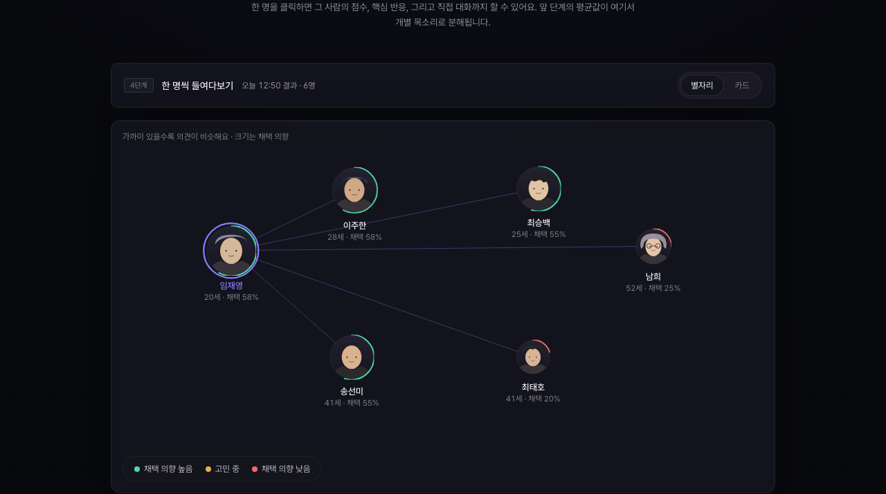

<div align="center">

# Upkinsey

**제품 출시 전에 시장 반응을 먼저 시뮬레이션하는 self-hostable synthetic research lab**

제품 brief 하나로 한국형 persona panel을 만들고, 반응·반대 이유·가격 저항·검증 질문·founder memo까지 한 번에 뽑아냅니다.

[한국어](README.md) · [English](README.en.md) · [Live demo](https://upstage.jaeyeong2026.com)

[](https://upstage.jaeyeong2026.com)
[](LICENSE)

[](https://console.upstage.ai/docs/capabilities/generate/chat)
[](https://huggingface.co/datasets/nvidia/Nemotron-Personas-Korea)




</div>

---

## What is Upkinsey?

Upkinsey는 **제품팀이 실제 고객 인터뷰를 시작하기 전에 가설을 빠르게 좁히는 도구**입니다.

제품 설명, 가격, 타깃, 현재 대체 행동을 입력하면 [nvidia/Nemotron-Personas-Korea](https://huggingface.co/datasets/nvidia/Nemotron-Personas-Korea) 기반 persona panel을 구성하고, [Upstage Solar](https://console.upstage.ai/docs/capabilities/generate/chat)가 persona별 반응을 구조화합니다. 결과는 단순 점수가 아니라, 제품팀이 바로 써먹을 수 있는 objection, segment, pricing signal, validation plan, analyst interview transcript로 정리됩니다.

> Upkinsey is a **pre-research** tool. Synthetic persona signals are directional: they help prioritize hypotheses, but they do not replace real customer discovery or statistically valid surveys.

## Why teams use it

- 제품 아이디어가 너무 많을 때, **먼저 검증할 segment**를 고릅니다.
- “좋아 보인다”가 아니라 **왜 망설이는지**를 persona별로 분해합니다.
- 가격 문제인지, 신뢰 문제인지, 메시지 문제인지 **objection의 종류**를 나눕니다.
- 실제 인터뷰 전에 **좋은 follow-up 질문**을 자동으로 만듭니다.
- 매번 같은 실험을 반복하지 않도록 **simulation run을 저장하고 비교**합니다.

## Screenshots

<table>
  <tr>
    <td width="50%">
      
      <br />
      <sub><b>Landing</b> — research workflow at a glance</sub>
    </td>
    <td width="50%">
      
      <br />
      <sub><b>Brief runner</b> — product context, pricing, and target setup</sub>
    </td>
  </tr>
</table>

## Core features

- **Synthetic persona panel** — Korean persona sampling designed around Nemotron-Personas-Korea
- **Brief preflight** — checks missing target, pricing, alternatives, and research assumptions
- **Persona reactions** — adoption, need-fit, understanding, price resistance, risks, positive drivers
- **Analyst interview mode** — multi-turn persona interviews that probe recent behavior, current alternatives, barriers, proof needs, and next action
- **Objection mining** — recurring reasons people hesitate, grouped into actionable themes
- **Segment recommendation** — beachhead segment suggestions with risk caveats
- **Pricing sensitivity lab** — willingness-to-pay probes and price-friction signals
- **Validation pack** — screener, field interview guide, survey draft, and experiment backlog
- **Founder memo** — concise decision memo for go / refine / pivot discussions
- **Run history** — save, reload, and compare simulation versions
- **Self-hosting guardrails** — Basic Auth, rate limits, active job limits, and destructive API opt-in

## Quick start

### 1. Install

```bash
git clone https://github.com/Jaeyeong-CHOI/upkinsey.git
cd upkinsey

python3 -m venv .venv
source .venv/bin/activate
pip install -e '.[persona]'
```

### 2. Configure secrets

```bash
cp .env.example .env
```

```env
UPSTAGE_API_KEY=your_upstage_api_key
UPKINSEY_REQUIRE_BASIC_AUTH=1
UPKINSEY_BASIC_AUTH_USER=operator
UPKINSEY_BASIC_AUTH_PASSWORD=change-this-password
```

### 3. Run tests

```bash
PYTHONPATH=src python3 -m unittest discover -s tests -p 'test*.py' -v
```

### 4. Start the app

```bash
python scripts/run_upkinsey_server.py --port 5173
```

Open:

```text
http://localhost:5173
```

## Docker

```bash
docker build -t upkinsey .
docker run --rm -p 5173:5173 \
  -e UPSTAGE_API_KEY="$UPSTAGE_API_KEY" \
  -e UPKINSEY_REQUIRE_BASIC_AUTH=1 \
  -e UPKINSEY_BASIC_AUTH_USER=operator \
  -e UPKINSEY_BASIC_AUTH_PASSWORD=change-this-password \
  upkinsey
```

## Configuration

| Variable | Default | Description |
| --- | --- | --- |
| `UPSTAGE_API_KEY` | — | Server-side Upstage API key |
| `UPSTAGE_MODEL` | `solar-pro3` | Solar chat model |
| `UPSTAGE_BASE_URL` | Upstage chat completions URL | Chat completion endpoint |
| `UPKINSEY_REQUIRE_BASIC_AUTH` | `1` in `.env.example` | Enable HTTP Basic Auth |
| `UPKINSEY_BASIC_AUTH_USER` | — | Basic Auth username |
| `UPKINSEY_BASIC_AUTH_PASSWORD` | — | Basic Auth password |
| `UPKINSEY_ALLOW_DESTRUCTIVE_API` | `0` | Allow `DELETE /api/runs*` |
| `UPKINSEY_MAX_PARALLEL_REQUESTS` | `2` | Persona API worker parallelism |
| `UPKINSEY_MAX_ACTIVE_JOBS` | `2` | Process-wide active simulation jobs |
| `UPKINSEY_RATE_LIMIT_PER_MINUTE` | `30` | Per-client mutating API rate limit |
| `UPKINSEY_JOB_TTL_SECONDS` | `3600` | In-memory async job snapshot TTL |
| `UPSTAGE_MAX_RETRIES` | `8` | Retry budget for 429/5xx/transport failures |
| `UPSTAGE_MIN_REQUEST_INTERVAL_SECONDS` | `1.1` | Process-wide Upstage request spacing |

See [`PUBLIC_DEPLOYMENT.md`](PUBLIC_DEPLOYMENT.md) for Render, Docker, auth, persistence, and production checklist notes.

## API surface

| Method | Path | Purpose |
| --- | --- | --- |
| `GET` | `/api/health` | Health and deployment safety status |
| `POST` | `/api/simulate/start` | Start async simulation job |
| `GET` | `/api/simulate/jobs/{job_id}` | Poll simulation progress/result |
| `POST` | `/api/persona-chat` | Ask one persona a follow-up question |
| `POST` | `/api/analyst-question` | Run multi-turn analyst interviews |
| `POST` | `/api/document-brief` | Extract product brief from PDF |
| `GET` | `/api/runs` | List saved simulation versions |
| `GET` | `/api/runs/{version_id}` | Load saved simulation result |
| `GET` | `/api/runs/compare/{version_id}` | Compare with previous related run |

## Persona data

Upkinsey is designed around [nvidia/Nemotron-Personas-Korea](https://huggingface.co/datasets/nvidia/Nemotron-Personas-Korea). To sample a compact local JSONL panel:

```bash
python scripts/sample_nemotron_personas.py \
  --seed 42 \
  --n 100 \
  --output data/personas/sample.jsonl
```

Sampled persona files and simulation outputs are gitignored by default.

## Project structure

```text
prototype/                 # React/Babel browser prototype served by Python
scripts/run_upkinsey_server.py
                           # Static server + API endpoints
src/upstage_api_sim/       # Core simulation, Upstage client, run store
examples/                  # Example product briefs
docs/                      # Design, persona prompting, service docs
tests/                     # Unit tests
PUBLIC_DEPLOYMENT.md       # Self-hosting and production checklist
```

## Safety & privacy

- Keep API keys in `.env` or deployment secrets only. Never expose them to the browser.
- Saved runs live under `data/simulation_runs/` and are gitignored.
- Uploaded PDFs are parsed in-memory in the API flow; review retention/compliance requirements before production deployment.
- Public deployments should enable Basic Auth, job limits, and rate limits.
- Synthetic outputs are for hypothesis generation, not representative survey evidence.

## Roadmap

- [ ] Public demo mode that avoids exposing paid API quota
- [ ] Pluggable persona providers
- [ ] Database/object-store backend for multi-user deployments
- [ ] Notion / Google Docs / Sheets export
- [ ] CI workflow and container publish pipeline
- [ ] Admin dashboard for cost, rate limit, and failure monitoring

## Contributing

Upkinsey is currently in beta. Contributions are welcome once the public workflow is opened up.

1. Create a branch from `main`.
2. Run the test suite before opening a PR.
3. Do not commit secrets, sampled persona data, uploaded documents, or simulation outputs.
4. Document new environment variables in `.env.example` and `PUBLIC_DEPLOYMENT.md`.

## Team

- [Jaeyeong CHOI](https://github.com/Jaeyeong-CHOI)
- [@choihyun-1110](https://github.com/choihyun-1110)
- [@Mo-zZaAa](https://github.com/Mo-zZaAa)

## Attribution

- LLM / reasoning layer: [Upstage Solar](https://console.upstage.ai/docs/capabilities/generate/chat)
- Persona data support: [nvidia/Nemotron-Personas-Korea](https://huggingface.co/datasets/nvidia/Nemotron-Personas-Korea), licensed under CC-BY-4.0
- Logo: original project artwork for Upkinsey

## License

MIT © Jaeyeong CHOI
