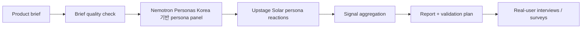

<div align="center">

# Upkinsey

**셀프 호스팅 가능한 합성 시장조사 프레임워크**<br>
제품 brief를 페르소나 반응, 시장 신호, objection, 검증 계획, founder-ready report로 바꿉니다.

[한국어](README.md) · [English](README.en.md)

[](LICENSE)

[](https://console.upstage.ai/docs/capabilities/generate/chat)
[](https://huggingface.co/datasets/nvidia/Nemotron-Personas-Korea)


</div>

---

## 왜 Upkinsey인가요?

제품을 출시하는 일은 비쌉니다. 그래서 출시 전에 가볍고 빠르게 시장 반응을 확인할 수 있어야 합니다.

Upkinsey는 제품 컨셉을 입력하면 [**nvidia/Nemotron-Personas-Korea**](https://huggingface.co/datasets/nvidia/Nemotron-Personas-Korea) 기반 한국형 synthetic persona panel에 보여주고, [**Upstage Solar**](https://console.upstage.ai/docs/capabilities/generate/chat)로 구조화된 반응과 리서치 결과를 생성합니다.

Upkinsey가 도와주는 질문:

- 누가 이 제품에 관심을 가질까?
- 반복적으로 등장하는 구매/사용 장벽은 무엇일까?
- 먼저 검증해야 할 beachhead segment는 어디일까?
- 가격이 문제일까, 가치 제안이 불명확한 걸까?
- 실제 사용자에게 다음으로 무엇을 물어봐야 할까?

> **중요:** Upkinsey는 pre-research 도구입니다. Synthetic persona signal은 가설을 빠르게 좁히기 위한 방향성 신호이며, 통계적 결론이나 실제 고객 조사를 대체하지 않습니다.

## 주요 기능

- [**Upstage Solar**](https://console.upstage.ai/docs/capabilities/generate/chat) reasoning과 [**nvidia/Nemotron-Personas-Korea**](https://huggingface.co/datasets/nvidia/Nemotron-Personas-Korea) persona data를 결합한 synthetic persona panel
- 제품 brief의 타깃, 가격, 대체 행동, 가설 누락을 점검하는 preflight
- Adoption / need-fit / price-risk signal과 evidence quality guardrail
- Objection mining과 segment recommendation
- Landing page / survey copy로 바로 옮길 수 있는 message angle test
- Willingness-to-pay probe를 위한 pricing sensitivity lab
- Screener, interview guide, survey draft를 포함한 validation plan
- Founder memo와 Markdown report export
- Simulation version 저장 및 이전 실행과 비교
- Paid API abuse를 줄이기 위한 self-hosting safety control

## 미리보기


## 작동 방식



## 빠른 시작

### 1. 설치

```bash
git clone https://github.com/Jaeyeong-CHOI/upkinsey.git
cd upkinsey

python3 -m venv .venv
source .venv/bin/activate
pip install -e '.[persona]'
```

### 2. 환경변수 설정

```bash
cp .env.example .env
```

`.env`를 열어 아래 값을 설정하세요.

```env
UPSTAGE_API_KEY=your_upstage_api_key
UPKINSEY_REQUIRE_BASIC_AUTH=1
UPKINSEY_BASIC_AUTH_USER=operator
UPKINSEY_BASIC_AUTH_PASSWORD=change-this-password
```

### 3. 테스트

```bash
PYTHONPATH=src python3 -m unittest discover -s tests -p 'test*.py' -v
```

### 4. 실행

```bash
python scripts/run_upkinsey_server.py --port 5173
```

브라우저에서 접속하세요.

```text
http://localhost:5173
```

## Self-hosting

Upkinsey는 정적 prototype과 API를 하나의 Python 서버에서 제공합니다. 공개 또는 준공개 배포에서는 서버의 [Upstage](https://console.upstage.ai/docs/capabilities/generate/chat) API key로 유료 API 호출이 발생하므로, Basic Auth와 rate/job limit을 켜는 것을 권장합니다.

권장 운영 기본값:

```env
UPKINSEY_REQUIRE_BASIC_AUTH=1
UPKINSEY_ALLOW_DESTRUCTIVE_API=0
UPKINSEY_MAX_PARALLEL_REQUESTS=2
UPKINSEY_MAX_ACTIVE_JOBS=2
UPKINSEY_RATE_LIMIT_PER_MINUTE=30
UPKINSEY_MAX_BODY_BYTES=1000000
UPKINSEY_MAX_DOCUMENT_BYTES=8000000
```

Render, Docker, 인증, persistence, 운영 주의사항은 [`PUBLIC_DEPLOYMENT.md`](PUBLIC_DEPLOYMENT.md)를 참고하세요.

### Docker

```bash
docker build -t upkinsey .
docker run --rm -p 5173:5173 \
  -e UPSTAGE_API_KEY="$UPSTAGE_API_KEY" \
  -e UPKINSEY_REQUIRE_BASIC_AUTH=1 \
  -e UPKINSEY_BASIC_AUTH_USER=operator \
  -e UPKINSEY_BASIC_AUTH_PASSWORD=change-this-password \
  upkinsey
```

## 주요 환경변수

| Variable | Default | Description |
| --- | --- | --- |
| `UPSTAGE_API_KEY` | — | 서버 측 Upstage API key |
| `UPSTAGE_MODEL` | `solar-pro3` | 사용할 Solar chat model |
| `UPSTAGE_BASE_URL` | Upstage chat completions URL | Chat completion endpoint |
| `UPKINSEY_REQUIRE_BASIC_AUTH` | `.env.example` 기준 `1` | HTTP Basic Auth 요구 여부 |
| `UPKINSEY_BASIC_AUTH_USER` | — | Basic Auth username |
| `UPKINSEY_BASIC_AUTH_PASSWORD` | — | Basic Auth password |
| `UPKINSEY_ALLOW_DESTRUCTIVE_API` | `0` | `DELETE /api/runs*` 허용 여부 |
| `UPKINSEY_MAX_PARALLEL_REQUESTS` | `2` | Persona API 병렬 worker 수 |
| `UPKINSEY_MAX_ACTIVE_JOBS` | `2` | Process-wide active simulation jobs |
| `UPKINSEY_RATE_LIMIT_PER_MINUTE` | `30` | Client별 mutating API rate limit |
| `UPKINSEY_JOB_TTL_SECONDS` | `3600` | In-memory async job snapshot TTL |
| `UPSTAGE_MAX_RETRIES` | `8` | 429/5xx/transport failure retry budget |
| `UPSTAGE_MIN_REQUEST_INTERVAL_SECONDS` | `1.1` | Process-wide Upstage request spacing |

PDF → brief 추출용 Document Parse 설정도 `.env.example`에 포함되어 있습니다.

## API surface

| Method | Path | Purpose |
| --- | --- | --- |
| `GET` | `/api/health` | Health와 deployment safety status 확인 |
| `POST` | `/api/simulate/start` | Async simulation job 시작 |
| `GET` | `/api/simulate/jobs/{job_id}` | Simulation progress/result polling |
| `POST` | `/api/persona-chat` | 개별 persona에게 follow-up 질문 |
| `POST` | `/api/analyst-question` | Analyst follow-up synthesis 실행 |
| `POST` | `/api/document-brief` | PDF에서 product brief 추출 |
| `GET` | `/api/runs` | 저장된 simulation version 목록 |
| `GET` | `/api/runs/{version_id}` | 저장된 simulation result 로드 |
| `GET` | `/api/runs/compare/{version_id}` | 이전 관련 run과 비교 |

## Persona data

Upkinsey는 [**nvidia/Nemotron-Personas-Korea**](https://huggingface.co/datasets/nvidia/Nemotron-Personas-Korea)를 기준으로 persona sampling을 설계합니다.

Compact local JSONL panel을 샘플링하려면:

```bash
python scripts/sample_nemotron_personas.py \
  --seed 42 \
  --n 100 \
  --output data/personas/sample.jsonl
```

샘플링된 persona 파일은 git에 포함되지 않도록 기본적으로 ignore됩니다.

## 프로젝트 구조

```text
prototype/                 # Python 서버가 제공하는 React/Babel browser prototype
scripts/run_upkinsey_server.py
                           # Static server + API endpoints
src/upstage_api_sim/       # Core simulation, Upstage client, run store
examples/                  # Example product briefs
docs/                      # Design, persona prompting, service docs
tests/                     # Unit tests
PUBLIC_DEPLOYMENT.md       # Self-hosting and production checklist
```

## Safety and privacy

- API key는 `.env` 또는 deployment secret에만 보관하고 브라우저에 노출하지 않습니다.
- 저장된 run은 `data/simulation_runs/` 아래 local JSON artifact이며 gitignore에 포함됩니다.
- 업로드된 PDF는 API flow에서 in-memory로 parse됩니다. 자체 retention/compliance 요구사항은 배포 전에 별도로 검토하세요.
- Public deployment는 paid Upstage quota를 사용하므로 Basic Auth, job limit, rate limit을 반드시 검토하세요.
- Synthetic result는 hypothesis generation 용도이며 대표성 있는 survey data가 아닙니다.

## Roadmap

- [ ] Paid API를 노출하지 않는 public demo mode
- [ ] Pluggable persona provider
- [ ] Multi-user deployment를 위한 database/object-store backend
- [ ] Notion / Google Docs / Sheets export
- [ ] CI workflow와 container publish pipeline
- [ ] Run cost, rate limit, failure monitoring admin dashboard

## Contributing

현재 이 저장소는 private beta입니다. 협업 시:

1. `main`에서 branch를 만듭니다.
2. PR 전에 test suite를 실행합니다.
3. Secret, sampled persona data, simulation output은 git에 넣지 않습니다.
4. 새 환경변수는 `.env.example`과 `PUBLIC_DEPLOYMENT.md`에 문서화합니다.

## Project team

Upkinsey는 아래 팀이 공동으로 수행한 collaborative project입니다.

- [Jaeyeong CHOI](https://github.com/Jaeyeong-CHOI)
- [@choihyun-1110](https://github.com/choihyun-1110)
- [@Mo-zZaAa](https://github.com/Mo-zZaAa)

## Attribution

- LLM / reasoning layer: [**Upstage Solar**](https://console.upstage.ai/docs/capabilities/generate/chat)
- Persona data support: [**nvidia/Nemotron-Personas-Korea**](https://huggingface.co/datasets/nvidia/Nemotron-Personas-Korea), licensed under CC-BY-4.0

```text
Upstage Solar: https://console.upstage.ai/docs/capabilities/generate/chat
Nemotron-Personas-Korea: https://huggingface.co/datasets/nvidia/Nemotron-Personas-Korea
```

## License

MIT © Jaeyeong CHOI
