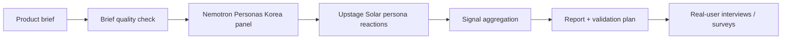

<div align="center">

# Upkinsey

**Self-hostable synthetic market research framework for product teams**<br>
제품 brief 하나로 persona reactions, market signals, objections, validation plan, founder memo까지 생성합니다.

[한국어](README.md) · [English](README.en.md) · [Demo page](https://upstage.jaeyeong2026.com)

[](https://upstage.jaeyeong2026.com)
[](LICENSE)

[](https://console.upstage.ai/docs/capabilities/generate/chat)
[](https://huggingface.co/datasets/nvidia/Nemotron-Personas-Korea)


</div>

---

## 왜 Upkinsey인가요?

제품을 시장에 내놓기 전에 확인해야 할 질문은 많습니다. 하지만 매번 광고를 태우거나 대규모 인터뷰를 돌리기는 부담스럽습니다.

Upkinsey는 제품 brief를 [**nvidia/Nemotron-Personas-Korea**](https://huggingface.co/datasets/nvidia/Nemotron-Personas-Korea) 기반 Korean synthetic persona panel에 보여주고, [**Upstage Solar**](https://console.upstage.ai/docs/capabilities/generate/chat)로 반응을 구조화해 early-stage market research에 필요한 signal을 뽑아냅니다.

Upkinsey가 빠르게 좁혀주는 질문들:

- 누가 이 제품에 먼저 반응할까?
- 반복해서 나오는 objection은 무엇일까?
- 어떤 segment를 먼저 검증해야 할까?
- 가격이 문제일까, value proposition이 흐린 걸까?
- 실제 user interview에서는 무엇을 물어봐야 할까?

> **Important:** Upkinsey는 pre-research tool입니다. Synthetic persona signal은 가설을 좁히기 위한 directional signal이며, 통계적 결론이나 실제 customer research를 대체하지 않습니다.

## 주요 기능

- [**Upstage Solar**](https://console.upstage.ai/docs/capabilities/generate/chat) + [**nvidia/Nemotron-Personas-Korea**](https://huggingface.co/datasets/nvidia/Nemotron-Personas-Korea) 기반 synthetic persona panel
- Product brief의 target, pricing, alternatives, hypothesis 누락을 점검하는 brief preflight
- Adoption / need-fit / price-risk signal과 evidence quality guardrail
- Objection mining과 segment recommendation
- Landing page / survey copy로 바로 옮길 수 있는 message angle test
- Willingness-to-pay probe를 위한 pricing sensitivity lab
- Screener, interview guide, survey draft를 포함한 validation plan
- Founder memo와 Markdown report export
- Simulation version 저장 및 이전 run과 비교
- Paid API abuse를 줄이기 위한 self-hosting safety controls

## Preview


## How it works



## Quick start

### 1. Install

```bash
git clone https://github.com/Jaeyeong-CHOI/upkinsey.git
cd upkinsey

python3 -m venv .venv
source .venv/bin/activate
pip install -e '.[persona]'
```

### 2. Configure `.env`

```bash
cp .env.example .env
```

`.env`에 server-side secret과 운영용 Basic Auth 값을 넣어주세요.

```env
UPSTAGE_API_KEY=your_upstage_api_key
UPKINSEY_REQUIRE_BASIC_AUTH=1
UPKINSEY_BASIC_AUTH_USER=operator
UPKINSEY_BASIC_AUTH_PASSWORD=change-this-password
```

### 3. Run tests

```bash
PYTHONPATH=src python3 -m unittest discover -s tests -p 'test*.py' -v
```

### 4. Start server

```bash
python scripts/run_upkinsey_server.py --port 5173
```

브라우저에서 열기:

```text
http://localhost:5173
```

## Self-hosting

Upkinsey는 static prototype과 API를 하나의 Python server에서 제공합니다. Public 또는 semi-public deployment에서는 server-side [Upstage](https://console.upstage.ai/docs/capabilities/generate/chat) API key로 paid API call이 발생하므로, Basic Auth와 rate/job limit을 켜는 구성을 권장합니다.

Recommended production defaults:

```env
UPKINSEY_REQUIRE_BASIC_AUTH=1
UPKINSEY_ALLOW_DESTRUCTIVE_API=0
UPKINSEY_MAX_PARALLEL_REQUESTS=2
UPKINSEY_MAX_ACTIVE_JOBS=2
UPKINSEY_RATE_LIMIT_PER_MINUTE=30
UPKINSEY_MAX_BODY_BYTES=1000000
UPKINSEY_MAX_DOCUMENT_BYTES=8000000
```

Render, Docker, auth, persistence, 운영 체크리스트는 [`PUBLIC_DEPLOYMENT.md`](PUBLIC_DEPLOYMENT.md)를 참고하세요.

### Docker

```bash
docker build -t upkinsey .
docker run --rm -p 5173:5173 \
  -e UPSTAGE_API_KEY="$UPSTAGE_API_KEY" \
  -e UPKINSEY_REQUIRE_BASIC_AUTH=1 \
  -e UPKINSEY_BASIC_AUTH_USER=operator \
  -e UPKINSEY_BASIC_AUTH_PASSWORD=change-this-password \
  upkinsey
```

## Configuration

| Variable | Default | Description |
| --- | --- | --- |
| `UPSTAGE_API_KEY` | — | Server-side Upstage API key |
| `UPSTAGE_MODEL` | `solar-pro3` | Solar chat model |
| `UPSTAGE_BASE_URL` | Upstage chat completions URL | Chat completion endpoint |
| `UPKINSEY_REQUIRE_BASIC_AUTH` | `.env.example` 기준 `1` | HTTP Basic Auth 사용 여부 |
| `UPKINSEY_BASIC_AUTH_USER` | — | Basic Auth username |
| `UPKINSEY_BASIC_AUTH_PASSWORD` | — | Basic Auth password |
| `UPKINSEY_ALLOW_DESTRUCTIVE_API` | `0` | `DELETE /api/runs*` 허용 여부 |
| `UPKINSEY_MAX_PARALLEL_REQUESTS` | `2` | Persona API worker parallelism |
| `UPKINSEY_MAX_ACTIVE_JOBS` | `2` | Process-wide active simulation jobs |
| `UPKINSEY_RATE_LIMIT_PER_MINUTE` | `30` | Per-client mutating API rate limit |
| `UPKINSEY_JOB_TTL_SECONDS` | `3600` | In-memory async job snapshot TTL |
| `UPSTAGE_MAX_RETRIES` | `8` | 429/5xx/transport failure retry budget |
| `UPSTAGE_MIN_REQUEST_INTERVAL_SECONDS` | `1.1` | Process-wide Upstage request spacing |

PDF → brief extraction에 쓰는 Document Parse 옵션도 `.env.example`에 포함되어 있습니다.

## API surface

| Method | Path | Purpose |
| --- | --- | --- |
| `GET` | `/api/health` | Health 및 deployment safety status 확인 |
| `POST` | `/api/simulate/start` | Async simulation job 시작 |
| `GET` | `/api/simulate/jobs/{job_id}` | Simulation progress/result polling |
| `POST` | `/api/persona-chat` | 특정 persona에게 follow-up 질문 |
| `POST` | `/api/analyst-question` | Analyst follow-up synthesis 실행 |
| `POST` | `/api/document-brief` | PDF에서 product brief 추출 |
| `GET` | `/api/runs` | 저장된 simulation versions 목록 |
| `GET` | `/api/runs/{version_id}` | 저장된 simulation result 로드 |
| `GET` | `/api/runs/compare/{version_id}` | 이전 관련 run과 비교 |

## Persona data

Upkinsey의 persona sampling은 [**nvidia/Nemotron-Personas-Korea**](https://huggingface.co/datasets/nvidia/Nemotron-Personas-Korea)를 기준으로 설계되어 있습니다.

Compact local JSONL panel을 샘플링하려면:

```bash
python scripts/sample_nemotron_personas.py \
  --seed 42 \
  --n 100 \
  --output data/personas/sample.jsonl
```

샘플링된 persona files는 기본적으로 gitignore 처리됩니다.

## Project structure

```text
prototype/                 # React/Babel browser prototype served by Python
scripts/run_upkinsey_server.py
                           # Static server + API endpoints
src/upstage_api_sim/       # Core simulation, Upstage client, run store
examples/                  # Example product briefs
docs/                      # Design, persona prompting, service docs
tests/                     # Unit tests
PUBLIC_DEPLOYMENT.md       # Self-hosting and production checklist
```

## Safety & privacy

- API keys는 `.env` 또는 deployment secrets에만 보관하고 browser에 노출하지 않습니다.
- Saved runs는 `data/simulation_runs/` 아래 local JSON artifacts이며 gitignore 처리됩니다.
- Uploaded PDFs는 API flow에서 in-memory로 parse됩니다. 자체 retention/compliance 요구사항은 deployment 전에 별도로 검토하세요.
- Public deployment는 paid Upstage quota를 사용할 수 있으므로 Basic Auth, job limit, rate limit을 반드시 확인하세요.
- Synthetic results는 hypothesis generation 용도이며 representative survey data가 아닙니다.

## Roadmap

- [ ] Paid API를 노출하지 않는 public demo mode
- [ ] Pluggable persona providers
- [ ] Multi-user deployment를 위한 database/object-store backend
- [ ] Notion / Google Docs / Sheets export
- [ ] CI workflow와 container publish pipeline
- [ ] Run cost, rate limit, failure monitoring admin dashboard

## Contributing

현재 이 repository는 private beta입니다. 협업 시:

1. `main`에서 branch를 만듭니다.
2. PR 전에 test suite를 실행합니다.
3. Secrets, sampled persona data, simulation outputs는 git에 넣지 않습니다.
4. 새 environment variables는 `.env.example`과 `PUBLIC_DEPLOYMENT.md`에 문서화합니다.

## Project team

Upkinsey는 아래 팀이 공동으로 수행한 collaborative project입니다.

- [Jaeyeong CHOI](https://github.com/Jaeyeong-CHOI)
- [@choihyun-1110](https://github.com/choihyun-1110)
- [@Mo-zZaAa](https://github.com/Mo-zZaAa)

## Attribution

- LLM / reasoning layer: [**Upstage Solar**](https://console.upstage.ai/docs/capabilities/generate/chat)
- Persona data support: [**nvidia/Nemotron-Personas-Korea**](https://huggingface.co/datasets/nvidia/Nemotron-Personas-Korea), licensed under CC-BY-4.0

```text
Upstage Solar: https://console.upstage.ai/docs/capabilities/generate/chat
Nemotron-Personas-Korea: https://huggingface.co/datasets/nvidia/Nemotron-Personas-Korea
```

## License

MIT © Jaeyeong CHOI
