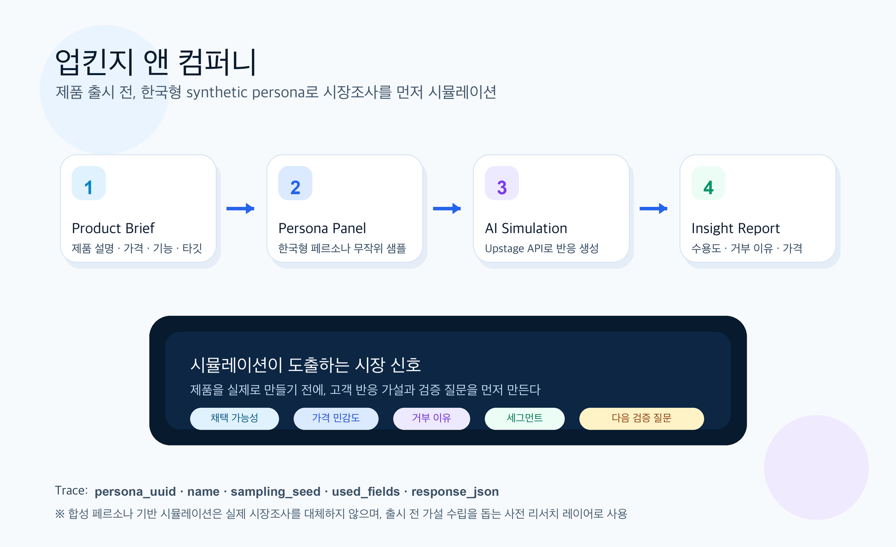

# 업킨지 앤 컴퍼니 — 서비스 기획 초안



## 1. 한 줄 정의

**업킨지 앤 컴퍼니**는 제품을 실제 시장에 내놓기 전에, 한국형 synthetic persona 패널을 대상으로 시장조사를 먼저 시뮬레이션해보는 AI 리서치 서비스다.

> Product idea → Synthetic Korean market panel → Simulated research → Market insight report

## 2. 목표

초기 제품/기능/가격/메시지를 두고 “이게 시장에서 먹힐까?”를 빠르게 가늠한다.

전통적인 시장조사처럼 완벽한 대표성을 보장하려는 서비스가 아니라, 다음 질문에 빠르게 답하는 **pre-research simulator**를 목표로 한다.

- 어떤 고객군이 가장 먼저 반응할까?
- 어떤 고객군은 왜 거부할까?
- 제품 설명에서 무엇이 잘 이해되고, 무엇이 헷갈릴까?
- 가격/기능/포지셔닝 중 무엇이 가장 큰 병목일까?
- 실제 설문/인터뷰를 하기 전에 어떤 가설을 세워야 할까?

## 3. 핵심 사용자

### 1) 초기 제품팀 / 스타트업

- 랜딩페이지, MVP, 피치덱 전에 시장 반응을 빠르게 점검하고 싶다.
- 실제 설문을 돌리기 전에 질문지를 다듬고 싶다.

### 2) PM / 마케터

- 기능 우선순위, 메시지, 가격 전략을 비교하고 싶다.
- 여러 세그먼트별 반응 차이를 보고 싶다.

### 3) 연구자 / 수업 프로젝트 팀

- 제품 아이디어에 대한 가상 사용자 반응 데이터를 만들고 싶다.
- 시장조사 프로세스를 실험 가능한 형태로 재현하고 싶다.

## 4. 서비스 가치 제안

업킨지 앤 컴퍼니의 가치는 “정답 제공”이 아니라 **초기 불확실성 축소**다.

| 기존 방식 | 문제 | 업킨지 방식 |
|---|---|---|
| 설문조사 | 설계/모집/비용 부담 | 먼저 가상 패널로 질문과 가설을 검증 |
| 인터뷰 | 소수 표본/시간 부담 | 다양한 persona와 대화 시뮬레이션 |
| 내부 회의 | 팀 편향 강함 | 외부 고객처럼 반응하는 synthetic panel 사용 |
| 단순 LLM 피드백 | 한 명의 추상적 의견 | N명의 persona 반응을 집계하고 segment별로 분석 |

## 5. 핵심 데이터

초기 persona source는 [`nvidia/Nemotron-Personas-Korea`](https://huggingface.co/datasets/nvidia/Nemotron-Personas-Korea)를 사용한다.

사용 방식:

1. dataset에서 seed 기반으로 persona를 랜덤 샘플링한다.
2. row에서 이름을 파싱해 `name`으로 저장한다.
3. 연령, 지역, 직업, 가족구성, 관심사, 목표 등을 compact persona로 변환한다.
4. 제품 조사 목적에 맞게 simulation role을 부여한다.
5. Upstage API가 persona별 actor response를 생성한다.

중요한 점:

- persona는 “역할극 설정”이 아니라 행동 prior다.
- demographic만으로 고정관념적 판단을 만들지 않는다.
- `uuid`, `name`, `sampling_seed`, `used_fields`를 trace에 남겨 재현성을 확보한다.

## 6. 사용자 플로우

### Step 1. Product Brief 입력

사용자가 제품 아이디어를 입력한다.

예시 입력:

```json
{
  "product_name": "AI 식단 코치 앱",
  "description": "냉장고 사진과 건강 목표를 기반으로 식단을 추천하는 앱",
  "target_market": "한국 20-60대 스마트폰 사용자",
  "price_options": ["무료", "월 4900원", "월 9900원"],
  "key_features": ["냉장고 사진 인식", "혈당 친화 메뉴", "장보기 리스트 자동 생성"]
}
```

### Step 2. Research Design 선택

조사 유형을 고른다.

- Concept test: 제품 아이디어 첫 반응
- Message test: 랜딩페이지 문구 반응
- Pricing test: 가격 민감도
- Feature priority: 기능 우선순위
- Objection mining: 거부 이유/불신 포인트
- Segment discovery: 어떤 고객군이 강하게 반응하는지 탐색

### Step 3. Persona Panel 구성

Nemotron persona에서 N명을 뽑는다.

MVP 기본값:

```json
{
  "sample_size": 100,
  "sampling_method": "streaming_shuffle_take",
  "seed": 42,
  "optional_strata": ["province", "age_bucket"]
}
```

### Step 4. Simulation 실행

각 persona에게 제품을 보여주고, 구조화된 응답을 받는다.

핵심 질문:

- 제품을 이해했는가?
- 본인에게 필요한가?
- 가장 매력적인 점은 무엇인가?
- 가장 걱정되는 점은 무엇인가?
- 지불 의향은 어느 정도인가?
- 실제 사용 가능성은 어느 정도인가?
- 주변 사람에게 추천할 것인가?

### Step 5. Market Insight Report 생성

결과를 집계해 리포트를 만든다.

리포트 구성:

1. Executive summary
2. Adoption likelihood distribution
3. Segment별 반응 차이
4. Top positive drivers
5. Top objections
6. Pricing sensitivity
7. Messaging 개선안
8. 실제 검증해야 할 질문 리스트
9. 다음 실험 추천

## 7. 시뮬레이션 응답 스키마

persona별 제품 반응은 JSON으로 저장한다.

```json
{
  "persona_uuid": "...",
  "name": "전기태",
  "segment_tags": ["70대", "광주", "현장직", "배우자와 거주"],
  "understanding_score": 0.82,
  "need_fit_score": 0.41,
  "adoption_likelihood": 0.28,
  "willingness_to_pay": {
    "selected_price": "무료",
    "reason": "유료 구독에는 신중하지만 무료 체험은 해볼 수 있음"
  },
  "positive_drivers": [
    "생활에 바로 연결되는 실용성"
  ],
  "objections": [
    "스마트폰 사용 부담",
    "개인 건강정보 입력에 대한 불안"
  ],
  "suggested_message": "복잡한 건강관리보다 매일 먹는 밥상을 쉽게 챙겨준다는 점을 강조",
  "quote": "공짜로 한번 써보는 건 몰라도, 돈 내고 매달 쓰는 건 좀 더 믿음이 가야겠네요.",
  "used_persona_fields": ["age", "occupation", "family_persona", "hobbies_and_interests"]
}
```

## 8. MVP 기능 범위

### 반드시 만들 것

- Product brief 입력
- Nemotron persona 랜덤 샘플링
- 이름 파싱 포함 compact persona 저장
- persona별 제품 반응 simulation
- JSONL trace 저장
- aggregate report markdown 생성
- overview figure / report figure 생성

### 나중에 만들 것

- 웹 대시보드
- persona cluster visualization
- competitor comparison
- simulated focus group
- survey questionnaire generator
- real survey 결과와 synthetic 결과 비교

## 9. 시스템 구성

```text
Product Brief
    ↓
Research Planner
    ↓
Persona Sampler ── Nemotron-Personas-Korea
    ↓
Simulation Orchestrator
    ↓
Upstage Actor Calls
    ↓
Response Validator / Trace Logger
    ↓
Insight Aggregator
    ↓
Market Research Report
```

## 10. 포지셔닝

업킨지 앤 컴퍼니는 컨설팅 회사처럼 “전략 리포트”를 만들지만, 실제 컨설턴트가 아니라 AI persona simulation을 활용한다.

브랜드 톤:

- 똑똑하지만 과장하지 않음
- 컨설팅 리포트처럼 명료함
- 데이터/trace 기반으로 설명 가능
- “AI가 정답을 냈다”가 아니라 “초기 시장 가설을 만들었다”에 초점

## 11. 리스크와 주의문구

서비스 안에 반드시 들어가야 할 disclaimer:

> 이 결과는 synthetic persona 기반 시장조사 시뮬레이션이며, 실제 소비자 조사나 통계적으로 대표성 있는 시장조사를 대체하지 않습니다. 실제 출시/투자 의사결정 전에는 실제 사용자 조사로 검증해야 합니다.

## 12. 다음 구현 단계

1. `ProductBrief` schema 정의
2. `ResearchPlan` schema 정의
3. `MarketReaction` response schema 정의
4. Upstage API actor prompt 작성
5. persona N명 샘플링 → 반응 JSONL 생성
6. aggregate report generator 작성
7. 샘플 제품 하나로 end-to-end demo 생성
